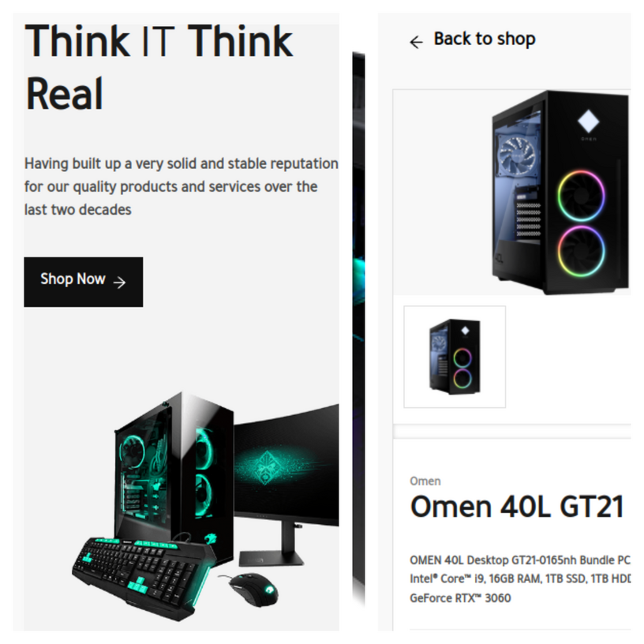

## PC Shop React

<div id="top"></div>
<!-- PROJECT LOGO -->
<div align="center">
  
<a href="https://github.com/VuDej/pc-shop#readme"><strong>Explore the docs »</strong></a>
<br />
<br />
 <a href="https://pc-shop-dejan.web.app/">View Demo</a>
.
<a href="https://github.com/VuDej/pc-shop">Report Bug</a>
·
<a href="https://github.com/VuDej/pc-shop">Request Feature</a>

</div>


## Screenshots



## Description 🏗️

Top web application built with react-redux and firebase. The user can see the list of products (PC) and the recommended list created using the marketing algorithm. User can register with email, google account, fb account and github account. The user can add the product to the cart, and order the product by adding the delivery address and pay for the product online. The administrator manages the users and creates the product. Added various filters for product search.

<p align="right">(<a href="#top">back to top</a>)</p>

## Getting Started 🏁

### Prerequisites and Dependencies 📜

You will be needing:

- A terminal terminal
- A code editor
- React(follow the instructions based on your OS)
  ```bash
  https://reactjs.org/docs/create-a-new-react-app.html
  ```

### Clone this repository

```bash
git clone https://github.com/VuDej/pc-shop.git
```

### Move into the directory with

```bash
cd pc-shop
```

### Install linter

```bash
npm install
```

### Start server

```bash
npm start
```

### Install linter

```bash
npm install
```

### Run linter

For Stylelint:

```bash
npx stylelint "**/*.{css,scss}"
```

#### Auto-correct

For stylelint:

```bash
npx stylelint "**/*.{css,scss}" --fix
```{
  "env": {
    "browser": true,
    "es6": true,
    "jest": true
  },
  "parser": "@babel/eslint-parser",
  "parserOptions": {
    "ecmaFeatures": {
      "jsx": true
    },
    "ecmaVersion": 2018,
    "sourceType": "module"
  },
  "extends": ["airbnb", "plugin:react/recommended"],
  "plugins": ["react"],
  "rules": {
    "react/jsx-filename-extension": ["warn", { "extensions": [".js", ".jsx"] }],
    "react/react-in-jsx-scope": "off",
    "import/no-unresolved": "off",
    "no-shadow": "off"
  },
  "ignorePatterns": [
    "dist/",
    "build/"
  ]
}

```bash
npm start
```

<p align="right">(<a href="#top">back to top</a>)</p>

## Built With 🔨

<div align="center">

## Technology Stack 🛠️  

                                                                                                                                                      

   

 |
      

<div align="center">

                                                                                                                                                                                                                                                                                                                                                        

<p align="right">(<a href="#top">back to top</a>)</p>
</div>

## Authors ✍️

<div align="center">

| 👤 vudej |
| -------- |

| <a target="_blank" href="https://github.com/VuDej"></a> <a target="_blank" href="https://www.linkedin.com/in/dejan-vujovic/"></a> <a target="_blank" href="https://twitter.com/DejanVuj"></a>
|

</div>

<p align="right">(<a href="#top">back to top</a>)</p>

## 🤝 Contributors

Contributions, issues, and feature requests are greatly appreciated!

If you have a suggestion that would make this better, please fork the repo and create a pull request. You can also simply open an issue with the tag "improvements".

- Fork the Project
- Create your Feature Branch (git checkout -b feature/yourfeaturename)
- Commit your Changes (git commit -m 'Add suggested feature')
- Push to the Branch (git push origin feature/AmazingFeature)
- Open a Pull Request

Feel free to check the [issues page](https://github.com/VuDej/pc-shop.git/issues).

<p align="right">(<a href="#top">back to top</a>)</p>

## 📝 License

This project is licensed by [](LICENSE)

## Show your support 💪

Give a ⭐️ if you like this project!


<p align="right">(<a href="#top">back to top</a>)</p>
